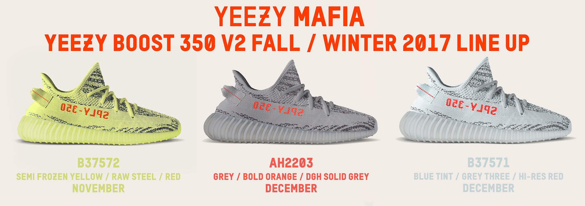
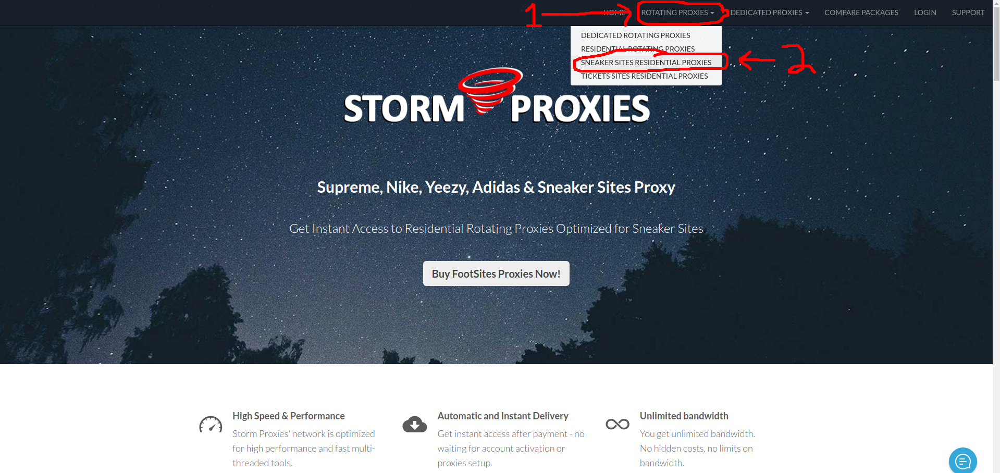
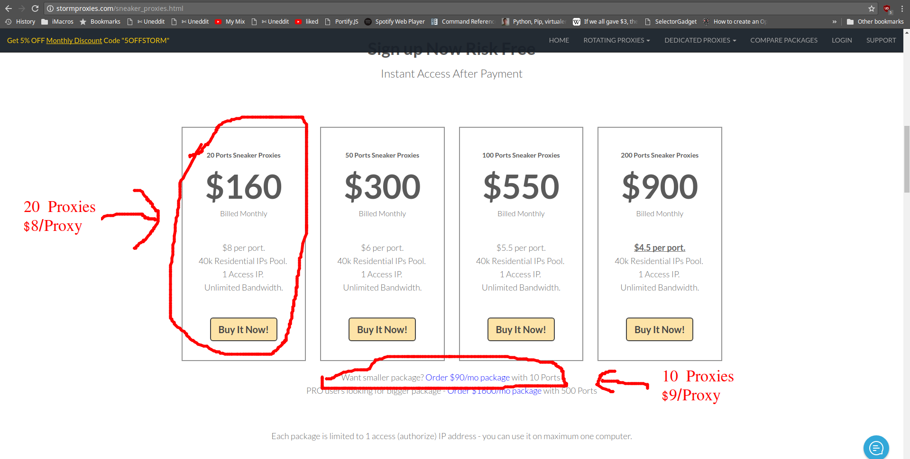

[](#)

# **REVAMPING THE SNEAKER BOT (UPDATED 10/16/17)**

## [Video series showing how to run this program](https://www.youtube.com/watch?v=Ipha5rBEKEw)

Over the next month or so leading up to the release of the [Semi-Frozen Yellow](https://www.highsnobiety.com/2017/08/10/kanye-semi-frozen-yellow-adidas-yeezy-boost-350-v2/) Yeezys I will be updating this repository with the bot *I* will be using to buy this shoe.

After the release I will create an update to my Youtube Series with a tutorial to reproduce the results.

# Adding Proxies

The ability to add proxies from the command line has been added in the most recent commit.

Main.py will search system arguments for proxies.

Proxy input example:

```$ python app.py 139.130.4.5:3226 131.150.1.5:4221```


# Which Proxies to Buy

## [CLICK HERE TO GET PROXIES](https://stormproxies.com/clients/aff/go/Christopherlambert106)

[](#)

[](#)

## To Do

- Transfer Main.createHeadlessBrowser() headers to main.convertHeadless()

- Add proxy to main.convertHeadless()

- Add Updating Screenshot to index.html

- Add box for "refresh rate" to index.html

- Add some sort of timeout to PhantomJS & Firefox window
